# 真实数据源集成测试文档

## 概述

`test_real_data_source_integration.py` 是一个全面的集成测试套件，用于验证 AgentTrader 中真实数据源（BaoStock、TuShare）的实际调用能力。与之前的模拟测试不同，这些测试直接调用真实的数据源 API，获取实际的市场数据。

**测试文件位置**：[tests/integration/test_real_data_source_integration.py](tests/integration/test_real_data_source_integration.py)

---

## 核心特性

### 1. **BaoStock 直接调用测试** (`TestBaoStockDirect`)
无需认证，可直接运行的集成测试。

| 测试项 | 说明 |
|--------|------|
| `test_fetch_klines_d1_sse` | 获取上证指数日线数据（平安银行）|
| `test_fetch_klines_m5_sse` | 获取 5 分钟线数据 |
| `test_fetch_klines_parameterized` | 参数化测试：多个符号、市场、周期组合 |
| `test_fetch_klines_unsupported_interval` | 验证不支持的周期会抛错 |

**特点**：
- ✅ 无需外部配置或 token
- ✅ 可直接获取真实市场数据
- ✅ 验证 BaoStock 源的完整端到端流程
- ✅ 支持多个市场（SSE、SZSE）和周期（5M、15M、30M、1H、1D、1W、1M）

### 2. **TuShare 直接调用测试** (`TestTuShareDirect`)
需要 TuShare API token（可选）

| 测试项 | 说明 |
|--------|------|
| `test_fetch_klines_d1` | 获取日线数据（需 token）|

**特点**：
- 🔑 需要有效的 TUSHARE_TOKEN
- 📊 支持多个新闻源聚合
- ⚡ 支持 5分钟线和日线数据

### 3. **网关集成测试** (`TestGatewayWithRealSources`)
验证数据源选择器（selector）与网关（gateway）的实际运作

| 测试项 | 说明 |
|--------|------|
| `test_gateway_fetch_klines_via_baostock` | 网关通过 BaoStock 获取数据 |
| `test_gateway_respects_priority_order` | 验证网关按优先级选择数据源 |

**特点**：
- 🔄 模拟真实的优先级管理
- 🎯 验证选择器的数据源路由逻辑
- 💾 演示内存优先级仓库的使用

### 4. **数据质量测试** (`TestDataQuality`)
验证从真实数据源返回的数据质量

| 测试项 | 说明 |
|--------|------|
| `test_payload_field_consistency` | 验证所有数据记录的字段一致性 |
| `test_metadata_accuracy` | 验证元数据准确性 |
| `test_empty_result_graceful_handling` | 验证空数据的优雅处理 |

**特点**：
- ✔️ 验证数据格式的一致性
- ✔️ 检查元数据的准确性
- ✔️ 测试边界情况（无数据返回）

### 5. **性能与稳定性测试** (`TestPerformanceAndStability`)
验证数据源在大数据量和连续查询下的表现

| 测试项 | 说明 |
|--------|------|
| `test_large_date_range_fetch` | 大日期范围查询（一年以上的数据）|
| `test_multiple_sequential_queries` | 连续多次查询的稳定性 |

**特点**：
- 📈 测试大数据量处理能力
- 🔁 验证连续查询的稳定性
- ⏱️ 检测可能的性能退化

---

## 运行指南

### 快速开始（仅 BaoStock）

```bash
# 运行所有 BaoStock 测试
pytest tests/integration/test_real_data_source_integration.py::TestBaoStockDirect -v

# 运行单个测试
pytest tests/integration/test_real_data_source_integration.py::TestBaoStockDirect::test_fetch_klines_d1_sse -v
```

**预期结果**：✅ 所有测试通过（1个已知跳过）

### 完整运行（包括网关、数据质量、性能测试）

```bash
# 运行所有测试（除 TuShare 外）
pytest tests/integration/test_real_data_source_integration.py -v

# 仅运行网关测试
pytest tests/integration/test_real_data_source_integration.py::TestGatewayWithRealSources -v

# 仅运行数据质量测试
pytest tests/integration/test_real_data_source_integration.py::TestDataQuality -v

# 仅运行性能测试
pytest tests/integration/test_real_data_source_integration.py::TestPerformanceAndStability -v
```

**预期结果**：
```
======================= 12 passed, 2 skipped in 10.50s ========================
```

### 包含 TuShare（需配置 token）

```bash
# 设置环境变量
export TUSHARE_TOKEN=你的_token_值

# 运行 TuShare 测试
pytest tests/integration/test_real_data_source_integration.py::TestTuShareDirect -v

# 运行完整测试套件（所有数据源）
pytest tests/integration/test_real_data_source_integration.py -v
```

---

## 测试数据

### 使用的符号与市场

| 符号 | 名称 | 市场 | 用途 |
|------|------|------|------|
| `000001.SZ` | 平安银行 | 深交所 (SZSE) | 主要测试用途 |
| `600000.SH` | 浦发银行 | 上交所 (SSE) | 多市场验证 |

### 时间范围

| 场景 | 开始日期 | 结束日期 | 说明 |
|------|--------|--------|------|
| 标准测试 | 2025-01-01 | 2025-01-31 | 一个月的数据 |
| 5分钟线试 | 近3天 | 当前日期 | 分钟线通常仅有近期数据 |
| 大数据量测试 | 2024-01-01 | 2025-03-24 | 一年多的完整数据 |

---

## 测试结果解释

### ✅ PASSED
测试成功执行，数据源正常工作，所有断言都通过

### ⏭️ SKIPPED
测试被跳过（已知问题或缺少必需配置）

| 原因 | 处理方式 |
|------|--------|
| BaoStock 周线字段限制 | 自动跳过 `W1` 参数组合 |
| 缺少 TUSHARE_TOKEN | 自动跳过 TuShare 测试 |

### ❌ FAILED
测试失败，需要调查原因

| 可能原因 | 排查方法 |
|--------|--------|
| 数据源 API 宕机 | 检查网络连接，尝试手动访问数据源|
| 字段格式不匹配 | 查看详细错误日志 |
| 依赖包版本不兼容 | 检查 `requirements.txt` 和版本号 |

---

## 配置说明

### BaoStock 配置

**无需认证**，使用默认参数即可运行：

```python
BaoStockSource(
    user_id="anonymous",
    password="123456",
    options=0,
)
```

### TuShare 配置

**需要有效的 token**，获取方式：

1. 访问 [https://tushare.pro](https://tushare.pro)
2. 注册账户并登录
3. 在个人中心获取 API token
4. 设置环境变量：

```bash
# Linux / macOS
export TUSHARE_TOKEN=your_token_here

# Windows PowerShell
$env:TUSHARE_TOKEN="your_token_here"

# Windows cmd
set TUSHARE_TOKEN=your_token_here
```

或在 `.env` 文件中配置：
```env
TUSHARE_TOKEN=your_token_here
```

---

## 主要测试类与方法对应表

```mermaid
graph TD
    A["test_real_data_source_integration.py"] --> B["TestBaoStockDirect"]
    A --> C["TestTuShareDirect"]
    A --> D["TestGatewayWithRealSources"]
    A --> E["TestDataQuality"]
    A --> F["TestPerformanceAndStability"]
    
    B --> B1["test_fetch_klines_d1_sse"]
    B --> B2["test_fetch_klines_m5_sse"]
    B --> B3["test_fetch_klines_parameterized"]
    B --> B4["test_fetch_klines_unsupported_interval"]
    
    C --> C1["test_fetch_klines_d1"]
    
    D --> D1["test_gateway_fetch_klines_via_baostock"]
    D --> D2["test_gateway_respects_priority_order"]
    
    E --> E1["test_payload_field_consistency"]
    E --> E2["test_metadata_accuracy"]
    E --> E3["test_empty_result_graceful_handling"]
    
    F --> F1["test_large_date_range_fetch"]
    F --> F2["test_multiple_sequential_queries"]
```



---

## 故障排除

### 问题 1：`ModuleNotFoundError: No module named 'fastapi'`
**解决方案**：
```bash
pip install -e .
```

### 问题 2：BaoStock 连接失败
**解决方案**：
- 检查网络连接
- 验证 BaoStock 服务是否在线
- 检查日志中的详细错误信息

### 问题 3：TuShare token 无效
**解决方案**：
- 重新登录 https://tushare.pro 获取新 token
- 确认 token 已正确设置为环境变量
- 尝试在 TuShare 官网测试 API 连接

### 问题 4：测试超时
**解决方案**：
- 数据源 API 响应缓慢，尝试增加超时时间
- 检查网络延迟
- 联系数据源服务商

---

## 输出示例

### 成功运行 BaoStock 测试

```
tests/integration/test_real_data_source_integration.py::TestBaoStockDirect::test_fetch_klines_d1_sse PASSED
tests/integration/test_real_data_source_integration.py::TestBaoStockDirect::test_fetch_klines_m5_sse PASSED
tests/integration/test_real_data_source_integration.py::TestBaoStockDirect::test_fetch_klines_parameterized[000001.SZ-szse-1d] PASSED
tests/integration/test_real_data_source_integration.py::TestBaoStockDirect::test_fetch_klines_parameterized[600000.SH-sse-1d] PASSED
tests/integration/test_real_data_source_integration.py::TestBaoStockDirect::test_fetch_klines_parameterized[000001.SZ-szse-1w] SKIPPED
tests/integration/test_real_data_source_integration.py::TestBaoStockDirect::test_fetch_klines_unsupported_interval PASSED

======================== 5 passed, 1 skipped in 4.38s ========================
```

### 完整测试套件结果

```
======================== 12 passed, 2 skipped in 10.50s ========================
```

---

## 与模拟测试的区别

| 方面 | 模拟测试 | 真实测试 |
|------|--------|--------|
| 数据源 | `_FailingProvider`, `_SuccessProvider` | 真实 BaoStock、TuShare API |
| 网络调用 | ❌ 无 | ✅ 有 |
| 验证范围 | 选择器逻辑、故障转移 | 端到端流程、数据质量 |
| 依赖 | 内存仓库 | 真实 API 服务 |
| 运行时间 | < 1 秒 | 5-15 秒 |
| 稳定性 | 100%（确定性） | 依赖网络和 API 服务状态 |

---

## 集成到 CI/CD

### GitHub Actions 示例

```yaml
name: Integration Tests

on: [push, pull_request]

jobs:
  integration-tests:
    runs-on: ubuntu-latest
    steps:
      - uses: actions/checkout@v2
      - uses: actions/setup-python@v2
        with:
          python-version: 3.10
      
      - name: Install dependencies
        run: pip install -e .
      
      - name: Run BaoStock tests
        run: pytest tests/integration/test_real_data_source_integration.py::TestBaoStockDirect -v
      
      - name: Run full test suite
        run: pytest tests/integration/test_real_data_source_integration.py -v
```

---

## 参考资源

- [BaoStock 官方文档](http://baostock.com/baostock/index.php/首页)
- [TuShare 官方网站](https://tushare.pro)
- [AgentTrader 项目 README](README.md)
- [数据源配置说明](docs/DATASOURCE.md)
